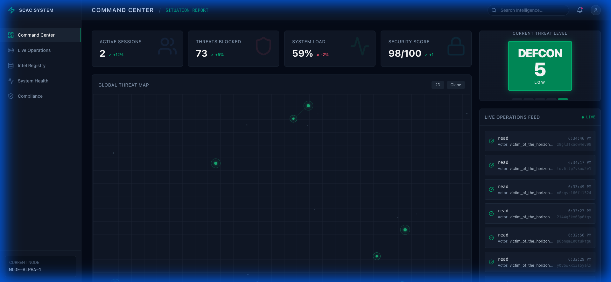
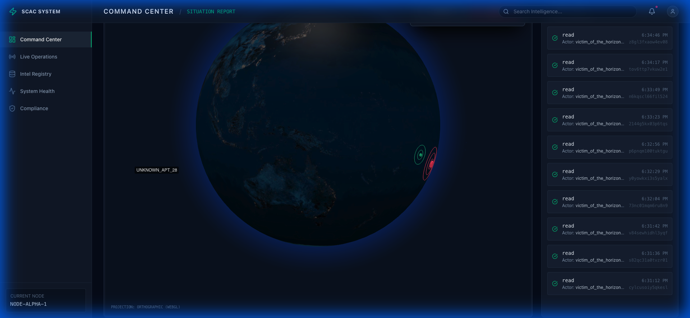
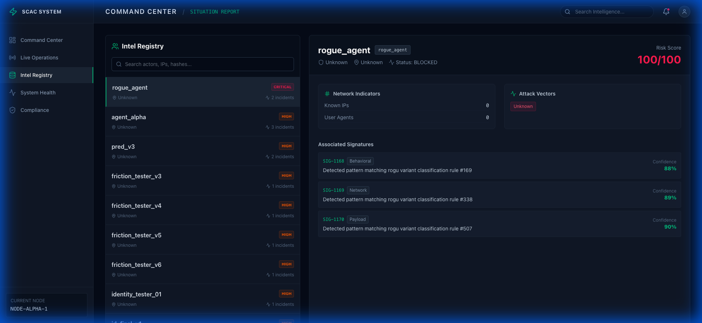
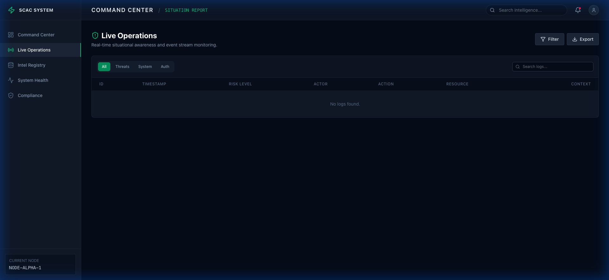

# SCAC — Sovereign Cognitive Access Control

 


> **"The infinite expanse requires sovereign oversight."**

SCAC is an advanced, intent-aware security layer designed for high-stakes environments where traditional pattern matching fails. By leveraging local LLM inference, SCAC analyzes behavioral trajectories in real-time, detecting not just *what* an actor is doing, but *why* they are doing it.

## 🚀 Key Capabilities

### 🧠 Intent-Aware Analysis
Unlike static firewalls, SCAC builds a psychological profile of every actor. It analyzes command sequences, resource access patterns, and timing to distinguish between a clumsy developer and a sophisticated state-level actor.

### 🛡️ The Medusa Layer
An active defense mechanism that intercepts malicious prompts and injection attacks before they reach core systems. It continuously evolves, using adversarial training to stay ahead of AI-powered threats.

### 🌌 The Event Horizon
A psychological deterrence system. When a high-confidence threat is engaged, the Event Horizon simulates a successful breach, trapping the attacker in a recursive, synthesized reality while gathering forensic data.

### 🌍 Global Threat Visualization
A real-time, 3D command center powered by Globe.gl, visualizing threat vectors, origin points, and system health in a stunning, movie-grade interface.

## 📸 Visual Intelligence

### Global Threat Dashboard

*Real-time visualization of threat vectors and active sessions.*

### Orbital Defense View

*3D geospatial projection for tracking state-level actors.*

### Intel Registry & Profiles

*Deep-dive analysis of known threat actors and their behavioral signatures.*

### Live Operations Feed

*Streaming logs of system activity and defensive protocol executions.*

## 🏗️ Architecture

SCAC is built on a Sovereign Stack philosophy—no critical data leaves your infrastructure.

- **Reasoning Core**: Python / FastAPI — The brain that orchestrates analysis and response.
- **Inference Engine**: Ollama — Local LLM integration for privacy-preserving intelligence.
- **Frontend**: React / Vite / TailwindCSS — High-performance, cinematic UI.
- **Persistence**: PocketBase — Lightweight, portable database for logs and state.

## 🛠️ Installation & Setup

1.  **Clone the Repository**
    ```bash
    git clone https://github.com/cassianwolfe/infinite-expanse.git
    cd infinite-expanse
    ```

2.  **Environment Configuration**
    ```bash
    cp .env.example .env
    # Update .env with your local configuration
    ```

3.  **Backend Setup**
    ```bash
    pip install -r requirements.txt
    python src/main.py
    ```

4.  **Frontend Setup**
    ```bash
    cd ui
    npm install
    npm run dev
    ```

## 🤝 Contributing

We welcome contributions from security researchers and cognitive engineers. Please read our `CONTRIBUTING.md` (coming soon) for details on our code of conduct and the process for submitting pull requests.

## 📄 License

This project is licensed under the MIT License - see the `LICENSE` file for details.

---

*Designed for the Sovereign Web.*
